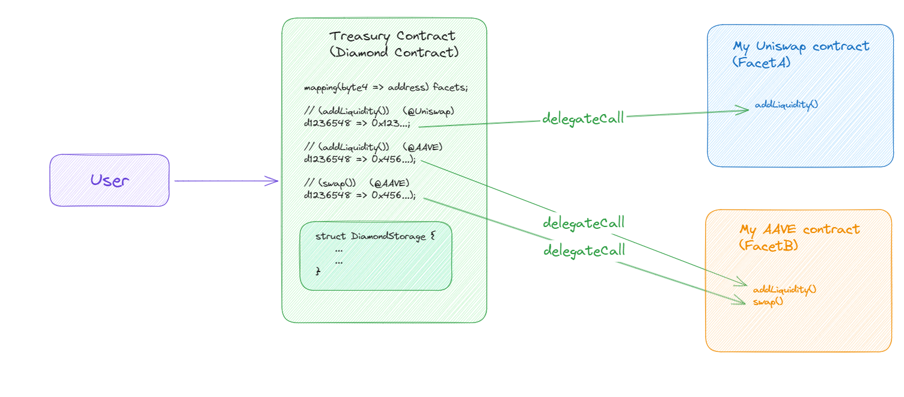

# ✨ Treasury Smart Contract ✨
The task is to connect a treasury smart contract to various DeFi protocols and liquidity pools. The contract have to accept stablecoins like USDC (ERC20 implementation), distribute funds across these protocols, and exchange them for USDT or DAI if necessary. The allocation ratios can be adjusted by the contract owner, and the contract should also support both partial and full withdrawals from DeFi platforms. Lastly, it should calculate the combined yield percentage from all linked protocols.

## 1- 🤔 What is a liquidity pool?
A liquidity pool is a DeFi concept that enables decentralized exchanges (DEXs) to function smoothly.

DEXs are digital platforms where users can exchange cryptocurrencies directly peer to peer and fully automated without the need for intermediaries like traditional financial institutions. The intermediaries here are smart contracts that automate the trades. Examples of popular DEXs include Uniswap, SushiSwap, and PancakeSwap.

To maintain such platforms we need liquidity to be able to quickly buy or sell an asset without significantly affecting its price. In traditional financial markets, liquidity is provided by market makers and institutions. In the context of DEXs, liquidity is provided by users and they are incentivized to do so. Peers who contribute their cryptocurrency assets to a liquidity pool are what we call liquidity providers.

A liquidity pool is a smart contract that holds pairs of cryptocurrencies to enable trading. For example, a liquidity pool can have USDC and DAI tokens. These assets are provided by liquidity providers.

## 2- 💧 How Liquidity Pools Work:
   - When users want to trade on a DEX, they don't need to find a counterparty directly. Instead, they trade against the liquidity pool.
   - When a user wants to swap one token for another, they send their tokens to the liquidity pool's smart contract.
   - The smart contract calculates the exchange rate based on the current ratio of tokens in the pool. This ratio adjusts automatically as users trade.
   - After the swap is completed, the user receives the desired tokens, and the pool's token ratios change.

Liquidity providers earn rewards for providing liquidity to these pools. Their earnings come from trading fees paid by users. A portion of each trade fee is distributed to the liquidity providers in proportion to their share of the pool.

Liquidity providers should be aware of the concept of impermanent loss, which is a temporary loss in value compared to simply holding the assets. This loss occurs due to price changes in the assets within the pool. Impermanent loss can affect LPs' overall returns.

Liquidity pools are a crucial component of DeFi ecosystems, as they allow for decentralized and automated trading while providing incentives for users to contribute their assets. However, they also come with risks and complexities, so users should carefully consider these factors before participating in liquidity provision.

## 3- 👻 AAVE liquidity pool:
For this project, we will integrate AAVE and Uniswap. the principle is the same for all protocols
An AAVE liquidity pool consists of two types of assets: one is an interest-bearing token representing the assets that have been deposited (like DAI, USDC, etc.), and the other is an interest-bearing asset (e.g., aTokens) that represents the LP's share of the pool. For instance, if you deposit DAI, you would receive aDAI in return. They will have to burn their aTokens to be able to withdraw their tokens from the liquidity pool.

Users of the Aave platform can borrow assets from these liquidity pools by collateralizing their own assets and paying interest. The interest paid by borrowers goes to the liquidity providers as a reward for supplying their assets to the pool.

## 4- 🦄 Uniswap liquidity pool:

A liquidity pool on Uniswap is a decentralized exchange mechanism where liquidity providers contribute pairs of tokens (e.g., USDT/DAI) to a smart contract. They earn fees in proportion to their contribution. The pool uses an automated market maker system to determine token prices, allowing users to trade directly with the pool. It's a key component of decentralized finance (DeFi) that enables trustless token swaps without the need for centralized intermediaries.

The two liquidity pools on AAVE and Uniswap have the same concept but are different.

The problem that we will have with implementing these liquidity pools in our smart contract is that each protocol needs a different way of integration. We don’t add liquidity on a Uniswap pool like we do on an AAVE pool. For this purpose, we need a complex implementation.

## 5- 🔧 Implementation:

Making all the implementation and the logic in one smart contract is the easiest way but the wrongest way to complete this task, and this is for many reasons. The first is that if we want to add a new protocol, we will need to make a snapshot of the current state of the treasury wallet, code and deploy a brand new smart contract including the stat of the old one and finally transfer the funds of the old smart contract to the new one. We will need to do this each time we want to add a new protocol.

Also, each protocol has its own implementation, there is no default addLiquidity() function to all protocols. That means that for each protocol we need to import the corresponding interface inside the smart contract. We will quickly reach the 24kb smart contract limit and we will get stuck.

The best solution is to create a modular smart contract system that can be extended after deployment. For this, we will use the ERC-2535 standard also known as Diamond or multi-facet proxy.

We will have the main contract (the Diamond contract) that will keep track of the owner, the distribution ratio, and the funds in each pool and it will be able to receive and manage ERC20 tokens.

This Diamond contract will be connected to what we call Facets. Facets are smart contracts that contain the logic.
With this approach, we can add as many implementations and protocols as we want. So we can add liquidity and swap tokens on any exchange. We just have to code the facet corresponding to the protocol implementation. Also, we can upgrade/change the logic of each implementation by making a new smart contract facet, connecting it to the Diamond contract, and deleting the old facet.

Here is a simple diagram of the implementation: 

📝 A simple smart contract that **ONLY** add liquidity to a AAVE pool is in this repo. The code is not supposed to be a Facet of the Diamond contract.